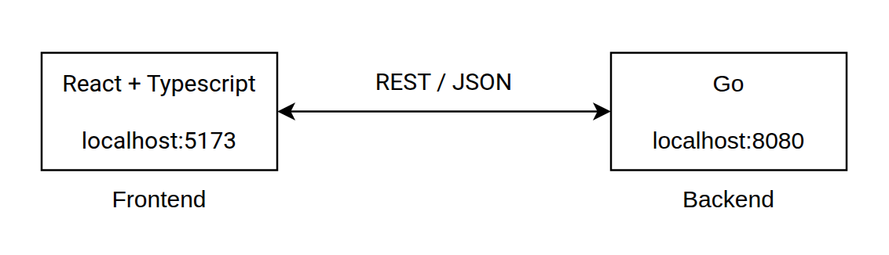

# Calculator

[](https://github.com/NicoG2023/calculator/actions/workflows/ci.yml)

A full-stack calculator built with **React + TypeScript** and **Go**.

## Features

- Addition, subtraction, multiplication, division, exponentiation, square root, and percentage (yes, I decided to include the optional operations)
- Scientific-notation input through the `EXP` key
- Division-by-zero, negative-square-root, invalid-input, and numeric-overflow handling
- Responsive calculator UI with light and dark themes
- REST API with JSON requests and responses
- Backend and frontend unit tests with coverage reporting
- Dockerized full-stack runtime with Nginx reverse proxy
- GitHub Actions CI for backend, frontend, and Docker smoke tests

## Prerequisites

For local development:

- Go 1.27.1
- Node.js 22 or newer
- npm 11 or newer

For the containerized setup:

- Docker Engine
- Docker Compose plugin (`docker compose`)

The versions used during development were Go 1.27.1, Node.js 22.18.0, and npm 11.12.1.

## Quick start with Docker

From the repository root:

```bash
docker compose up --build
```

Then open:

- Frontend: `http://localhost:3000`
- Backend health check: `http://localhost:8080/health`

Stop the stack with:

```bash
docker compose down
```

The frontend container is a production build served by Nginx. Requests to `/api/*` are proxied internally to the backend container, so the browser does not need to know Docker service hostnames.

## Local development

### 1. Run the backend

```bash
cd backend
go run ./cmd/server
```

The API listens on `http://localhost:8080` by default.

The port can be overridden when needed:

```bash
PORT=9000 go run ./cmd/server
```

### 2. Run the frontend

In a second terminal:

```bash
cd frontend
npm ci
npm run dev
```

Vite will normally expose the application at `http://localhost:5173`.

For local development, the frontend uses `http://localhost:8080` as the default API base URL. It can be overridden at build/development time with:

```bash
VITE_API_BASE_URL=http://localhost:9000 npm run dev
```

## REST API

### Health check

```http
GET /health
```

Response:

```json
{
  "status": "ok"
}
```

### Calculate

```http
POST /api/v1/calculate
Content-Type: application/json
```

Binary operations require both `a` and `b`:

- `add`
- `subtract`
- `multiply`
- `divide`
- `power`

Unary operations require only `a`:

- `sqrt`
- `percentage`

### Addition

```bash
curl -X POST http://localhost:8080/api/v1/calculate \
  -H 'Content-Type: application/json' \
  -d '{"operation":"add","a":10,"b":5}'
```

```json
{
  "result": 15
}
```

### Exponentiation

```bash
curl -X POST http://localhost:8080/api/v1/calculate \
  -H 'Content-Type: application/json' \
  -d '{"operation":"power","a":2,"b":8}'
```

```json
{
  "result": 256
}
```

### Square root

```bash
curl -X POST http://localhost:8080/api/v1/calculate \
  -H 'Content-Type: application/json' \
  -d '{"operation":"sqrt","a":81}'
```

```json
{
  "result": 9
}
```

### Percentage

The percentage API converts a percentage value to its decimal representation:

```bash
curl -X POST http://localhost:8080/api/v1/calculate \
  -H 'Content-Type: application/json' \
  -d '{"operation":"percentage","a":25}'
```

```json
{
  "result": 0.25
}
```

The calculator UI adds familiar contextual percentage behavior while still delegating arithmetic to the backend. For example:

```text
200 × 10% = 20
200 + 10% = 220
200 - 10% = 180
200 ÷ 10% = 2000
```

## Error handling

Errors are returned as JSON with an appropriate HTTP status.

Division by zero:

```bash
curl -X POST http://localhost:8080/api/v1/calculate \
  -H 'Content-Type: application/json' \
  -d '{"operation":"divide","a":10,"b":0}'
```

```json
{
  "error": "division by zero"
}
```

Other handled cases include:

| Situation | HTTP status | Example error |
| --- | ---: | --- |
| Malformed JSON or unknown fields | `400` | `invalid request body` |
| Missing operation | `400` | `operation is required` |
| Missing first operand | `400` | `a is required` |
| Missing second operand for a binary operation | `400` | `b is required` |
| Division by zero | `400` | `division by zero` |
| Square root of a negative number | `400` | `square root of a negative number` |
| Unsupported operation | `400` | `unsupported operation: "..."` |
| Non-finite arithmetic result | `400` | `result out of range` |
| Wrong HTTP method | `405` | `method not allowed` |

The decoder rejects unknown JSON fields and multiple JSON objects in a single request body.

## Scientific notation vs. exponentiation

The calculator intentionally exposes two different concepts:

- `EXP` is an **input key** for scientific notation. `1 EXP - 3` represents `1e-3`, or `0.001`.
- `xʸ` is the **arithmetic exponentiation operation**. `2 xʸ 8` calls the backend `power` operation and returns `256`.

Scientific notation is input formatting, not a separate backend arithmetic operation.

## Testing

### Backend

From `backend/`:

```bash
go test ./...
go vet ./...
```

Generate a detailed coverage report:

```bash
go test -coverprofile=coverage.out ./...
go tool cover -func=coverage.out
```

An optional HTML report can be generated with:

```bash
go tool cover -html=coverage.out -o coverage.html
```

The tests cover arithmetic behavior, error cases, request validation, response contracts, health checks, and HTTP method handling. The `cmd/server` package is intentionally thin wiring and is not unit-tested solely to inflate coverage.

### Frontend

From `frontend/`:

```bash
npm ci
npm run lint
npm test
npm run test:coverage
npm run build
```

The HTML coverage report is generated under:

```text
frontend/coverage/
```

Frontend tests focus on observable behavior: API integration, server errors, advanced operations, scientific notation, chained operations, percentage behavior, and theme persistence.

Coverage percentage is not used as a target by itself. Tests are added for meaningful behavior and edge cases rather than to force 100% coverage.

## Architecture



With Docker, Nginx serves the built React application and proxies `/api/*` requests to the Go container:

## Continuous integration

GitHub Actions runs on pushes and pull requests to `main`.

The workflow contains three independent quality gates:

1. **Backend** — tests with coverage, `go vet`, and server build
2. **Frontend** — `npm ci`, lint, tests with coverage, and production build
3. **Docker smoke test** — Compose validation, image build, full-stack startup, health check, direct backend calculation, frontend availability, and API access through the Nginx proxy

Backend and frontend coverage outputs are uploaded as CI artifacts on each successful run.

## Design decisions

### Standard library HTTP server

The backend uses Go's `net/http` and `encoding/json` packages instead of Gin, Fiber, or another framework. The API is small enough that adding a framework would increase surface area without solving a real problem.

### One calculation endpoint

All operations use `POST /api/v1/calculate`. The `operation` field identifies the requested behavior. This keeps the API compact and avoids several nearly identical endpoints.

### Unary and binary operations are explicit

The backend represents the second operand as optional. Binary operations validate that `b` exists, while `sqrt` and `percentage` operate only on `a`.

### `float64` is intentional

The calculator uses Go `float64` values. This is appropriate for a general-purpose calculator and keeps the API straightforward, but it does not provide arbitrary decimal precision and should not be treated as financial decimal arithmetic.

Results that become `NaN` or infinity are rejected as `result out of range` instead of being allowed to reach JSON serialization.

### Local React state is enough

The UI does not use Redux, Zustand, React Query, or another state-management library. Component state is sufficient for the size and lifetime of the calculator state.

### Docker uses a production frontend build

The frontend image builds the Vite application with Node and serves the generated static assets from Nginx. Nginx also proxies API traffic to the backend service. Node is not kept in the final runtime image.

## Assumptions and scope

- The application is a coding-assignment calculator, not a financial or scientific-computing package requiring arbitrary precision.
- Authentication, persistence, databases, and user accounts are outside the requested scope.
- CORS is intentionally permissive for this standalone assignment. A production multi-origin system would normally restrict allowed origins.
- The backend defaults to port `8080`; the frontend development server uses Vite's default port unless configured otherwise.
- The Dockerized frontend is exposed on port `3000` and proxies API calls to the backend container.
- Accessibility basics are included through semantic buttons, labels, focus states, and live result/error regions, without claiming full WCAG certification.

## Author

Developed by **Nicolás Guevara Herrán**.
